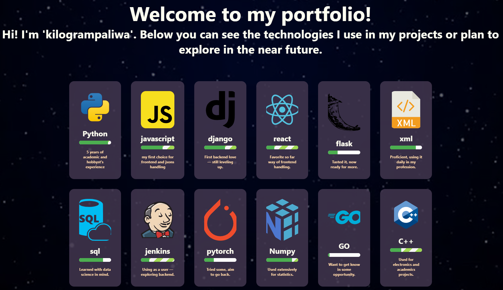

# 🌐 Multilingual Tech Portfolio

A React-based, multilingual portfolio showcasing technologies, learning goals, and progress. Features dynamic background integration and animated progress bars, all in a modern and responsive ayout.



## 🚀 Features

- 🌍 Language selector with support for:
  - 🇵🇱 Polish
  - 🇬🇧 English
  - 🇩🇪 German
  - cat Catalan
- 🎥 Animated background via [Tenor GIFs](https://tenor.com/)
- 📊 Progress bars with animation and directional indicators
- 🔄 Dynamic content fetched from a local `/api/technologies/` endpoint
- 💻 Responsive design

## 📁 Project Structure

```bash
.
├── public/
│   ├── images/             # Technology icons
│   └── api/technologies/   # Mock API endpoint (e.g., using JSON server or Next.js API route)
├── src/
│   ├── index.js            # Main React app
│   ├── index.css           # Global styles
│   └── lids-lang.json      # Localized strings for headline
```

## 🔧 Setup & Run

1. **Install dependencies**  
   ```bash
   npm install
   ```

2. **Run the project**  
   ```bash
   npm start
   ```

3. **Mock the API (optional)**  
   You can simulate the `/api/technologies/` endpoint using `json-server`, `vite-plugin-mock`, or your own solution.

## 🛠 Technologies Used

- React 18+
- CSS3
- Tenor Embed API
- REST API (mock or real)

## 📦 Deployment

The app can be deployed to:

- Vercel
- Netlify
- GitHub Pages (with minor adjustments)

## 📄 License

This project is licensed under the [MIT License](LICENSE).

---

Feel free to use, modify, and share!
